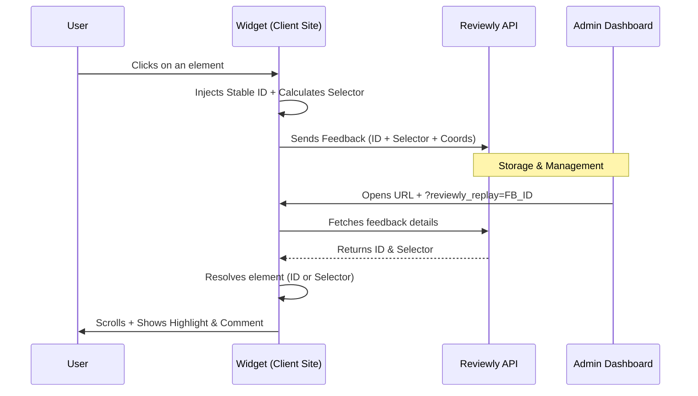

# Reviewly System Architecture

This document outlines the global architecture of the Reviewly solution, covering the Widget (SDK), the Admin interface (SaaS), and the Replay mechanism.

## 1. Component Overview

* **Widget (SDK)**: JS script injected into the client's website (`reviewly.js`). It captures interactions, renders markers (Outlines + Badges), and transmits feedback.
* **Admin (SaaS)**: Management interface for product teams. Allows viewing feedback lists and "Replaying" specific feedback items.
* **Replay Engine**: Mechanism that re-opens the client site and locates the exact element that was commented on.

## 2. Detailed Workflow

### A. Feedback Capture (SDK)

When a user clicks an element in "Review Mode", the SDK performs the following actions (`core/capture.ts`):

1. **Unique Identification**:
    * The SDK generates a unique ID (`reviewlyId`) and immediately injects it into the DOM: `data-reviewly-id="rv_..."`.
    * This ID serves as the "primary key" to reliably retrieve the element within the same session.
2. **CSS Selector Calculation**:
    * As a fallback (if the page is reloaded and the transient ID is lost), the SDK calculates the best possible unique CSS selector (e.g., `div.container > button:nth-of-type(2)`).
3. **Geometric Capture**:
    * Exact coordinates (`x, y`) within the element and viewport.
    * Screenshot (via html2canvas, optional depending on config).

> **API Payload Example**:
>
> ```json
> {
>   "reviewlyId": "rv_mku8c3gb",    // Stable Key
>   "selector": "#submit-btn",      // Fallback Key
>   "pageUrl": "https://...",
>   "metadata": { ... }
> }
> ```

### B. Immediate Visualization (Hybrid Marking)

To indicate to the user what is being annotated (`core/markers.ts` + `ui/badges-layer.ts`):

1. **Styling (CSS)**: The element receives the attribute `data-reviewly-annotated="draft"`.
    * A global CSS rule applies an **outline** (outer border) that perfectly follows scrolling and resizing.
2. **Badging (Overlay)**: A transparent layer is placed over the page.
    * Numbered badges ("1", "2") are absolutely positioned at the element's coordinates.
    * This hybrid approach bypasses the limitation of "void" elements (`<input>`, ``) which do not support CSS pseudo-elements.

### C. The "Replay" from Admin

This is the core feature: "How to find the right element?"

1. **Admin Action**:
    * The user clicks "View Feedback" in the Admin panel.
    * The Admin redirects to the client URL with a special parameter:
        `https://client-site.com/contact?reviewly_replay=fb_12345`
2. **Replay Activation (`core/replay.ts`)**:
    * The SDK detects `?reviewly_replay=` upon loading.
    * It fetches feedback details (selector, ID) from the API.
3. **Element Resolution**:
    * **Attempt 1 (ID)**: Searches for `[data-reviewly-id="rv_..."]`. If the element still exists (SPA navigation), this is a 100% match.
    * **Attempt 2 (Selector)**: If the ID is missing (page reload), it uses the stored CSS `selector` (e.g., `form > button.primary`).
4. **Highlighting**:
    * Once the element is found, the SDK forces `scrollIntoView()` to center it.
    * It displays a specific **Replay Overlay** (floating card) attached to the element.

## Data Flow Summary


